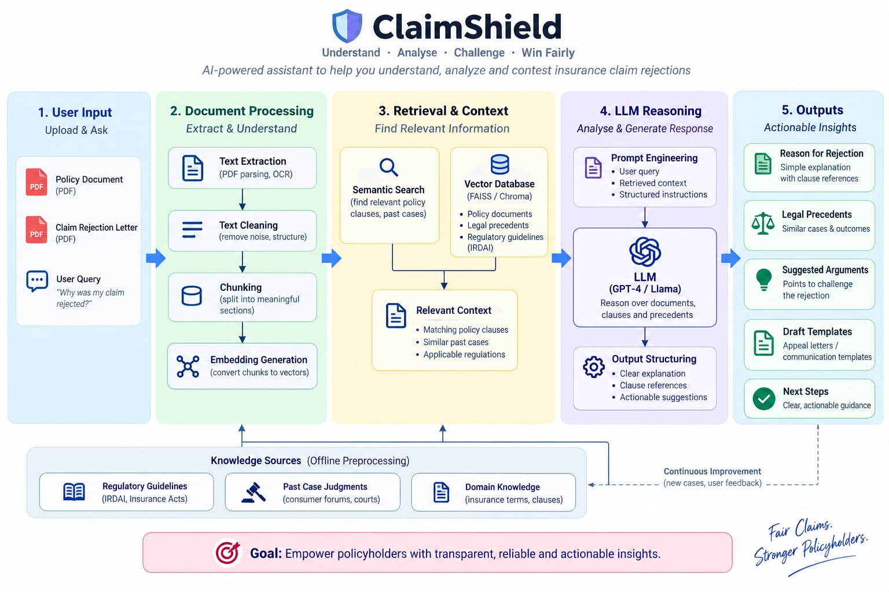
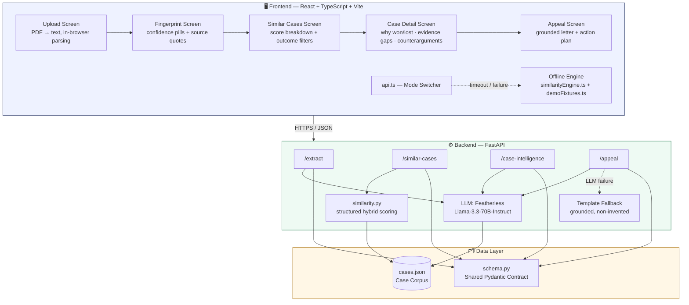

# 🛡️ ClaimShield

### AI-Powered Insurance Dispute Intelligence for Indian Health Insurance

**Upload a rejected claim. Discover what happened to people with cases like yours, why they won or lost, what evidence mattered, and what you can do next.**

[](https://claim-shield-neon.vercel.app/)
[](#-license)
[](https://fastapi.tiangolo.com/)
[](https://react.dev/)
[](https://www.typescriptlang.org/)

**[🚀 Live Demo](https://claim-shield-neon.vercel.app/) &nbsp;·&nbsp; [📖 API Docs](https://claimshield-p3bw.onrender.com/docs) &nbsp;·&nbsp; [🐛 Report a Bug](../../issues)**

---

## 📌 Table of Contents

- [Why ClaimShield](#-why-claimshield)
- [What It Actually Does](#-what-it-actually-does)
- [Architecture](#-architecture)
- [Tech Stack](#-tech-stack)
- [Project Structure](#-project-structure)
- [Getting Started](#-getting-started)
- [API Reference](#-api-reference)
- [Data & Similarity Model](#-data--similarity-model)
- [Trust & Safety Design](#-trust--safety-design)
- [Offline / Demo-Safe Mode](#-offline--demo-safe-mode)
- [Roadmap](#-roadmap)
- [Disclaimer](#-disclaimer)
- [Contributing](#-contributing)
- [License](#-license)

---

## 💡 Why ClaimShield

Health insurance policyholders in India routinely have claims rejected over **pre-existing disease non-disclosure**, **waiting periods**, **policy exclusions**, **documentation gaps**, and **partial settlements** — and almost never have a way to know:

> *"Has this happened to someone else? Did they win? What evidence mattered? What should I do next?"*

ClaimShield closes that information gap. It is **not** a generic "upload a PDF, chat with an AI" tool — it's a structured, evidence-grounded workflow purpose-built for one job: **find cases like yours, and tell you what actually worked.**

## ⚙️ What It Actually Does

```
Upload rejection letter + policy   →   Extract structured Case Fingerprint
        →   Search precedent corpus (hybrid scoring, not just embeddings)
        →   Show how similar cases were decided, and why
        →   Detect what evidence you're missing
        →   Predict the insurer's likely counterarguments
        →   Generate an evidence-backed grievance letter
        →   Give you a concrete, regulator-grounded action plan
```

| Feature | Description |
|---|---|
| 🔍 **Case Fingerprinting** | LLM-based structured extraction of insurer, claim amount, rejection category, condition, dates, and clause — every field traceable to a quoted source span |
| ⚖️ **Similar Case Engine** | Transparent, explainable hybrid similarity scoring (35% legal issue · 20% clause · 15% insurer · 15% facts · 10% claim value · 5% forum) — never a black-box embedding score |
| 📚 **Outcome Intelligence** | "Why did this case win or lose?" — every claim traced back to a specific precedent, never invented |
| 🕵️ **Evidence Gap Detector** | Compares your available documents against what similar winning cases actually used |
| 🛡️ **Insurer Counterargument Predictor** | Surfaces likely insurer defenses *before* you file, with rebuttal strategies |
| ✍️ **Grounded Appeal Generator** | Drafts a formal grievance letter — citations are restricted to real, retrieved precedents only |
| 🧭 **Escalation Roadmap** | GRO → IRDAI Bima Bharosa → Insurance Ombudsman → Consumer Commission, in the correct statutory order |
| ⚠️ **Honest "Insufficient Information" Mode** | The system explicitly refuses to force a confident answer when the underlying case record is too thin — this is a first-class product state, not an error page |
| 📡 **Automatic Offline Fallback** | If the backend is slow or down, the UI silently degrades to a local scoring engine + pre-baked fixtures — a judge (or a real user) never sees a frozen screen |

---

## 🏗️ Architecture





**Design principles baked into the architecture:**

1. **No black-box scoring.** Similarity is computed via explicit weighted rules (`similarity.py` / `similarityEngine.ts`), not opaque embeddings — every match ships with a human-readable "why is this similar?" breakdown.
2. **The LLM never freelances.** Rejection categories are constrained to a 5-value enum and normalized server-side even if the model drifts. Appeal letters can only cite precedents that were actually retrieved from the corpus.
3. **Graceful degradation everywhere.** Every backend call has a client-side timeout and a deterministic offline fallback — a flaky LLM provider or dead server never breaks the user-facing flow.
4. **One shared contract.** `backend/app/core/schema.py` is the single source of truth for field names across data, backend, and frontend, to prevent silent integration drift.

---

## 🧰 Tech Stack

| Layer | Technology |
|---|---|
| **Frontend** | React 19 · TypeScript · Vite 8 · `lucide-react` · `pdfjs-dist` (in-browser PDF text extraction) |
| **Backend** | Python · FastAPI · Pydantic v2 · Uvicorn |
| **AI / LLM** | Featherless AI (OpenAI-compatible) running `unsloth/Llama-3.3-70B-Instruct` |
| **Similarity Engine** | Hand-rolled structured scoring (weighted rules), mirrored in Python and TypeScript |
| **Data** | Curated JSON case corpus (`cases.json`) sourced from Consumer Commission orders, Insurance Ombudsman awards, and verified synthetic cases modeled on real award patterns |
| **Tooling** | Oxlint · TypeScript strict mode |

---

## 📁 Project Structure

```
claimshield/
├── backend/
│   ├── app/
│   │   ├── main.py                 # FastAPI app: /extract, /similar-cases, /case-intelligence, /appeal
│   │   ├── core/
│   │   │   ├── schema.py           # Shared Pydantic contract (CaseFingerprint, etc.)
│   │   │   ├── similarity.py       # Transparent hybrid similarity scoring
│   │   │   └── prompts.py          # Grounded LLM prompts with explicit "say insufficient info" escape hatch
│   │   └── data/
│   │       └── cases.json          # Curated precedent corpus
│   ├── .env.example
│   └── requirements.txt
│
├── Frontend-amogh/
│   ├── src/
│   │   ├── App.tsx                 # 5-screen workflow router
│   │   ├── components/
│   │   │   ├── Header.tsx
│   │   │   ├── StatusBadge.tsx     # Live Backend | Offline Demo indicator
│   │   │   └── screens/
│   │   │       ├── UploadScreen.tsx
│   │   │       ├── FingerprintScreen.tsx
│   │   │       ├── SimilarCasesScreen.tsx
│   │   │       ├── CaseDetailScreen.tsx
│   │   │       └── AppealScreen.tsx
│   │   ├── services/
│   │   │   ├── api.ts               # Live-backend + offline-fallback orchestration
│   │   │   └── similarityEngine.ts  # Client-side scoring fallback
│   │   ├── data/
│   │   │   ├── cases.json
│   │   │   └── demoFixtures.ts      # Pre-baked hero + insufficient-info scenarios
│   │   └── types/claim.ts           # Shared frontend data contract
│   └── package.json
│
├── docs/
│   ├── architecture-diagram.png
│   └── sample_rejection_letters.md  # Synthetic test letters for /extract
```

---

## 🚀 Getting Started

### Prerequisites

- **Node.js** 20.19+ or 22.12+
- **Python** 3.10+
- A [Featherless AI](https://featherless.ai/) API key

### 1. Backend Setup

```bash
cd backend
python -m venv venv
source venv/bin/activate        # Windows: venv\Scripts\activate

pip install -r requirements.txt

cp .env.example .env
# then edit .env and set:
# FEATHERLESS_API_KEY=your_key_here

uvicorn app.main:app --reload --port 8000
```

The API will be live at **http://localhost:8000** — interactive docs at **http://localhost:8000/docs**.

You should see a startup log confirming the corpus loaded, e.g. `Loaded 26 cases from corpus.`

### 2. Frontend Setup

```bash
cd Frontend-amogh
npm install
npm run dev
```

The app will be live at **http://localhost:5173**.

> By default the frontend targets `http://localhost:8000`. To point elsewhere, set `VITE_API_BASE_URL` in a `.env.local` file inside `Frontend-amogh/`.

### 3. Try It Instantly (No Setup Needed)

On the Upload screen, click either:

- **"Pre-fill Hero Case (PED Denial)"** — loads a fully worked diabetes non-disclosure dispute with 5 ranked precedents
- **"Load Insufficient-Info Case"** — demonstrates the system explicitly declining to give a confident answer when the record is too thin

Both work fully offline, with zero backend dependency.

### 4. Production Build

```bash
cd Frontend-amogh
npm run build      # tsc -b && vite build
npm run preview
```

---

## 📡 API Reference

Base URL: `https://claimshield-p3bw.onrender.com` (or `http://localhost:8000` when running locally)

| Method | Endpoint | Purpose |
|---|---|---|
| `POST` | `/extract` | Turn a rejection letter + policy text into a structured Case Fingerprint |
| `POST` | `/similar-cases` | Rank the corpus against a fingerprint using hybrid structured scoring |
| `POST` | `/case-intelligence` | Explain why a matched case won/lost, and surface evidence gaps + counterarguments |
| `POST` | `/appeal` | Generate a grounded grievance letter + action plan |
| `GET` | `/corpus` | Debug: dump the full loaded case corpus |
| `GET` | `/` | Health check |

<details>
<summary><strong>Example: <code>POST /extract</code></strong></summary>

```json
{
  "policy_text": "...policy clause text...",
  "rejection_text": "...rejection letter text...",
  "additional_text": ""
}
```

Returns a `rejection_reason` constrained to exactly one of:
`ped_non_disclosure` · `waiting_period` · `policy_exclusion` · `documentation` · `partial_settlement`

— or `null`, never a paraphrase or a hallucinated category. See [`docs/sample_rejection_letters.md`](./docs/sample_rejection_letters.md) for ready-to-use synthetic test letters.
</details>

Full interactive schema and try-it-out console: **`/docs`** (Swagger UI, auto-generated by FastAPI).

---

## 🧮 Data & Similarity Model

Similarity between a user's claim and a historical case is computed with an explicit, explainable weighted model — deliberately **not** a raw embedding distance, so every result can answer *"why is this similar?"* in plain language:

| Factor | Weight |
|---|---|
| Legal issue similarity (same rejection category) | **35%** |
| Policy clause similarity | **20%** |
| Same insurer | **15%** |
| Factual similarity (condition / treatment) | **15%** |
| Claim amount proximity | **10%** |
| Court / jurisdiction level | **5%** |

The corpus (`backend/app/data/cases.json`) blends:
- **Real cases**, sourced from Council for Insurance Ombudsmen Annual Reports (with clickable `source_url`)
- **Synthetic cases**, explicitly flagged `"synthetic": true`, modeled on realistic award patterns — never presented as real without disclosure

---

## 🛡️ Trust & Safety Design

ClaimShield is built around a hard rule: **never invent law, a case, an outcome, a clause, or a fact.**

- Every "why it won/lost" statement is traceable to a specific precedent — never floats unattributed.
- The extraction LLM is instructed to return `null` and flag `fields_needing_review` rather than guess.
- `rejection_reason` is **normalized server-side** onto a fixed 5-value enum regardless of what the LLM outputs, so downstream logic never silently breaks on a paraphrase.
- Appeal letters can only cite `source_citation` / `regulation_sources` values that exist in the corpus — synthetic or "illustrative" citations are explicitly filtered out before the letter is generated.
- The system has a dedicated **"Insufficient Information"** assessment state — used when a matched case's records are too thin to support a confident answer — rather than forcing false confidence. This is a designed product behavior, not a fallback error state.
- No numeric "win probability" is ever shown. Assessments are always one of: *Potentially Strong · Potentially Challengeable · Likely Consistent With Policy · Insufficient Information.*

---

## 🔌 Offline / Demo-Safe Mode

Every one of the four core API calls is wrapped with a client-side timeout and a deterministic fallback:

```
Live Backend (FastAPI + LLM)
        │  timeout / network error / non-200 / bad JSON
        ▼
Offline Engine (local similarityEngine.ts + demoFixtures.ts)
```

The `StatusBadge` in the header reflects this in real time (`Live Backend` ↔ `Offline Demo Engine`), so the mode is always visible — nothing is silently swapped without the user knowing.

---

## 🗺️ Roadmap

- [x] Health insurance MVP — 5 rejection categories
- [x] Hybrid, explainable similarity engine
- [x] Evidence gap detection + insurer counterargument prediction
- [x] Grounded appeal generation with citation filtering
- [ ] Expand corpus to 300–500 verified cases
- [ ] pgvector-backed semantic retrieval layer alongside structured scoring
- [ ] Motor / life / travel / property insurance support
- [ ] Regulation-version change detection
- [ ] Legal-assistance discovery directory
- [ ] Multilingual support

---

## ⚖️ Disclaimer

> ClaimShield identifies **potential grounds** for challenging an insurance claim rejection based on the supplied policy, claim documents, historical decisions, and cited regulatory material. It provides **informational decision support** and is **not a substitute for legal advice** or a determination of judicial liability or outcome. It does not guarantee any result and does not state that an insurer is legally wrong.

---

## 🤝 Contributing

Issues and pull requests are welcome. Before submitting a case-data PR, please verify any real (non-synthetic) case against its linked `source_url` — a mismatch between the summary and the actual order is the fastest way to lose credibility.

## 📄 License

MIT — see [`LICENSE`](./LICENSE) for details.

---

<div align="center">

**Built for policyholders who deserve to know what happened to people with cases like theirs.**

[⬆ Back to top](#-claimshield)

</div>
